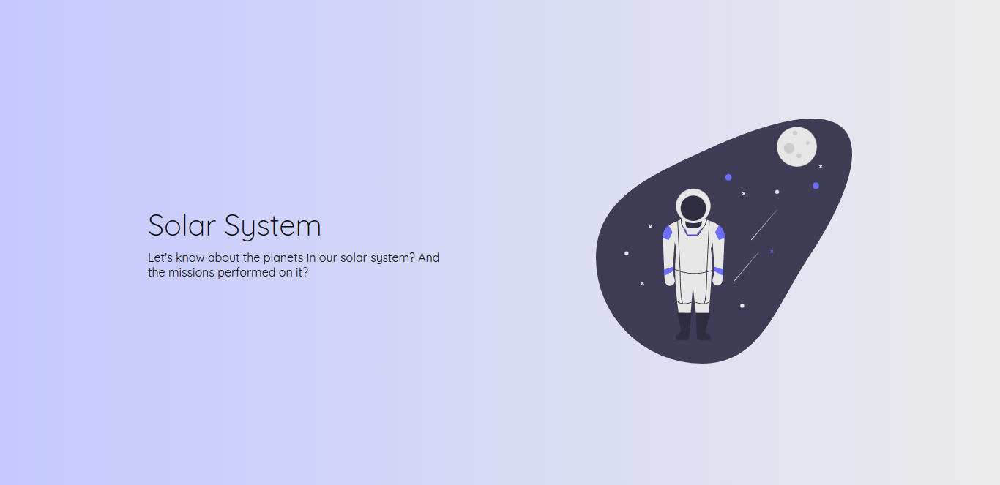
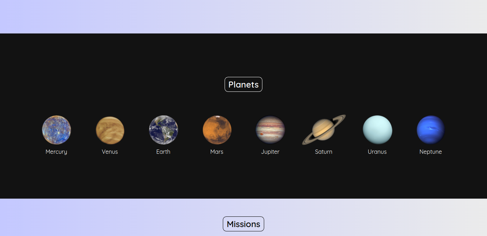

<h1>Project Solar System</h1>

> Status: Finished ✅

## About Project

> This was my first application in React, as simple as it is, I like the result. Its purpose is to show information about space missions and images of the planets.

## Technologies Used

* HTML
* CSS
* JavaScript
* React.js
* React Testing Library

## View Project

> https://project-solar-system-omega.vercel.app/
